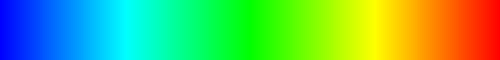

Pseudo Color
============

グレースケール画像を疑似カラー画像に変換

Convert to pseudo color image from grayscale image.

Features
--------
* linear function
* sigmoid function
* sin function

Examples
--------
### Linear


### Sigmoid


### Sin


How to Use
----------
```
go run pseudo-color mode in_path out_path
mode = (linear, sigmoid, sin)
```
